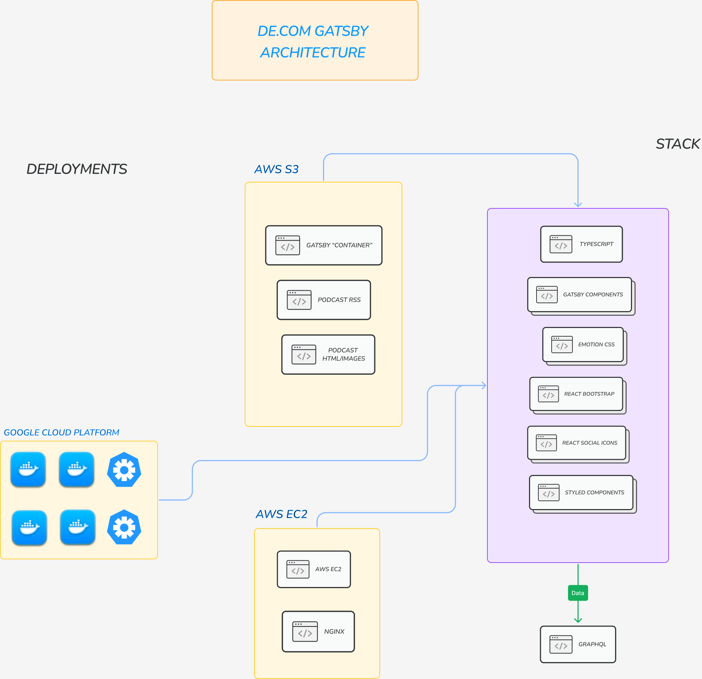
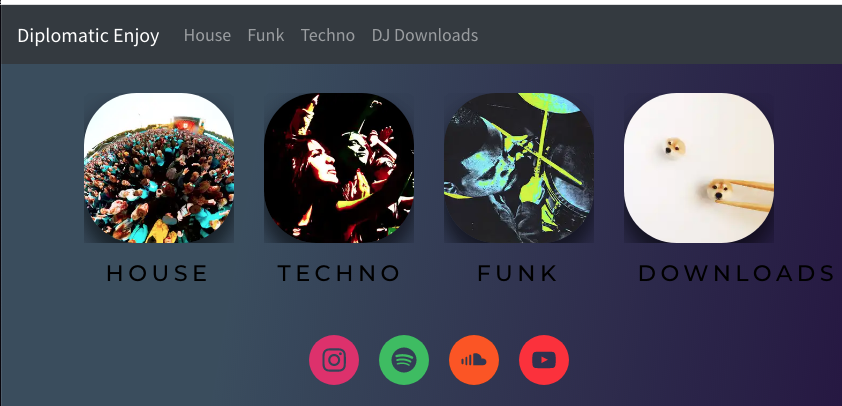
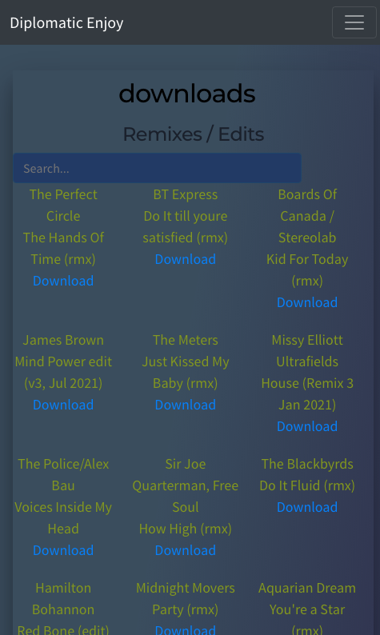
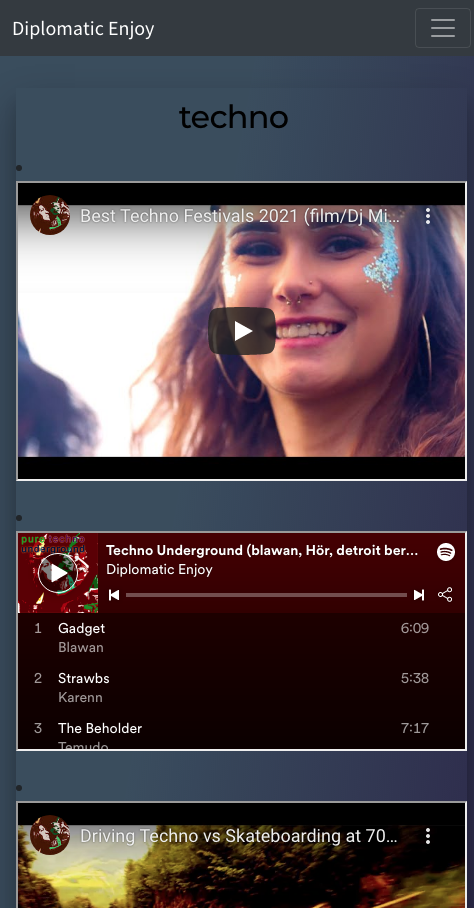
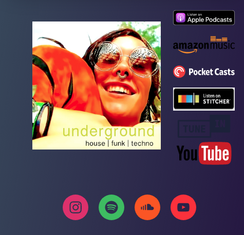

## What the app is for

This React/Gatsby app is fundamentally a website where a DJ/producer displays what they've created, mixes they've done, downloads etc. Original goal was to have it as fully extensible, with all content driven externally. This extensibility is partially done using Gatsby's blog content system.

## de.com Architecture

## Gatsby vs de.com Architecture

## Main app components

Main page (Index component)

Main (mobile view) (Index component)

DJ Mixes section (Mix component)

DJ Edits section (Mix component)

Funk section (Blog Post component)

House section (Blog Post component)

Techno section (Blog Post component)

Podcast 1 section

Podcast 2 section

## Technical details

- Gatsby
- GraphQL
- React JS / ES7 / Webpack
- React Hooks
- React Bootstrap
- Styled components
- Adobe Photoshop
- AWS EC2 / S3 - This was originally hosted on AWS EC2, but on S3 cause it's cheaper 😎
- Docker / Kubernetes - Also exists on Google Cloud / Docker / Kubernetes, will be live in this form soon

# Gatsby markup structure

For the page content, look outside of the src directory to a folder called content/blog. This is where Gatsby stores it's "blog content". These are markdown pages which are picked up the src/templates/blog-post.js component in the app.

To achieve this one:

1. One adds gatsby-source-filesystem plugin to gatsby-config.js

module.exports = {
plugins: [
{
resolve: `gatsby-source-filesystem`,
options: {
path: `${__dirname}/content/blog`,
name: `blog`,
},
},
],
}

2.  Configure gatsby-transformer-remark, which recognises Markdown files and reads their content

3.  Create a folder in the /src directory of your Gatsby application called content/blog. Now create Markdown file inside it e.g. techno/index.md.

4.  TODO Explain how the index page and the blog posts connect through Frontmatter/GraphQL

# Podcast

This website also hosts a podcast!

TODO Outline the structure, RSS, HTML files, how it sits in the static folder so it can be directly deployed etc.

# Graphic design

TODO: Add in all the podcast graphic design files

## How the app is started

gatsby develop - for local running

gatsby build - to create the files necessary to deploy to a production environment

npm run develop - this calls the gatsby develop command so can be used also. I'm adding a -H 0.0.0.0 so I can check the app on my phone

Default link the app runs at: `http://localhost:8000`!

Where GraphQL can be found (when running): \_`http://localhost:8000/___graphql`_. This is a tool you can use to experiment with querying your data. Learn more about using this tool in the [Gatsby tutorial](https://www.gatsbyjs.com/tutorial/part-five/#introducing-graphiql)._

## 🎓 Gatsby

Full documentation for Gatsby lives [on the website](https://www.gatsbyjs.com/).

- **Code samples, head [to documentation](https://www.gatsbyjs.com/docs/).** In particular, check out the _Guides_, _API Reference_, and _Advanced Tutorials_ sections in the sidebar.
